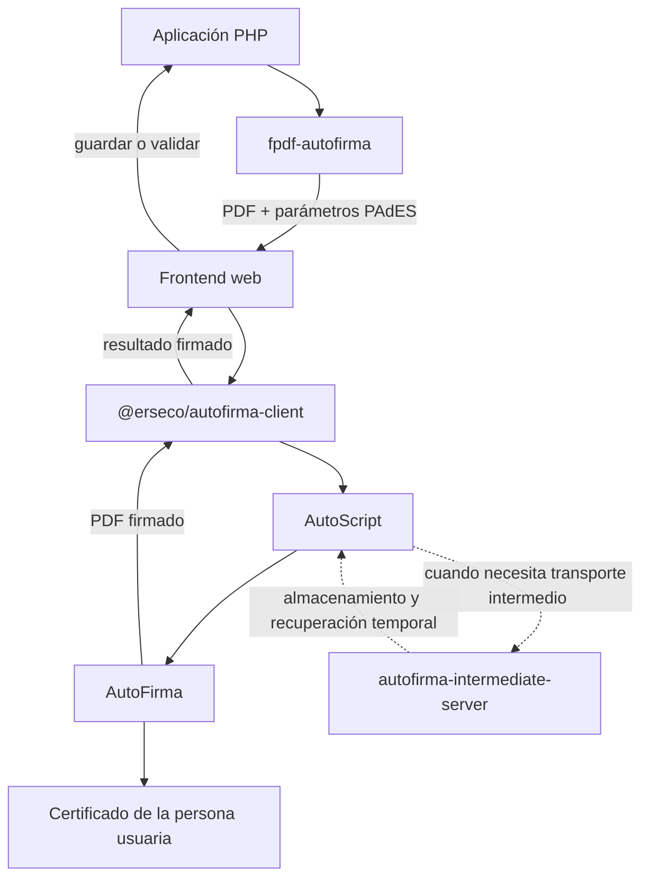

# FPDF AutoFirma

[](https://github.com/erseco/fpdf-autofirma/actions/workflows/ci.yml)
[](https://codecov.io/gh/erseco/fpdf-autofirma)
[](https://packagist.org/packages/erseco/fpdf-autofirma)
[](https://packagist.org/packages/erseco/fpdf-autofirma)
[](LICENSE)

Extension for the FPDF class ([www.fpdf.org](https://www.fpdf.org/)) providing AutoFirma integration, visible PAdES signature areas, and signing parameters for browser-based electronic signatures.

**Author:** [@erseco](https://github.com/erseco)  
**License:** MIT License — same as FPDF.

Integración de FPDF con AutoFirma para definir áreas de firma PAdES visibles y preparar los parámetros necesarios para firmar documentos desde el navegador mediante AutoScript.

> [!IMPORTANT]
> Este proyecto es independiente y no oficial. No pertenece al Gobierno de España, no incluye AutoFirma ni AutoScript, no firma en PHP y no valida firmas electrónicas.

## Instalación

Cuando el paquete esté publicado en Packagist:

```bash
composer require erseco/fpdf-autofirma
```

Composer instalará automáticamente `setasign/fpdf`.

## Requisitos e integración

FPDF AutoFirma se ocupa exclusivamente de generar el PDF y preparar los parámetros de una firma PAdES visible. La firma real se ejecuta fuera de PHP, en el navegador y en el equipo de la persona usuaria.

| Componente | ¿Cuándo hace falta? | Responsabilidad |
| --- | --- | --- |
| `erseco/fpdf-autofirma` | Siempre | Generar el PDF, definir el área visible y producir parámetros PAdES. |
| [AutoFirma](https://firmaelectronica.gob.es/Home/Descargas.html) | Para realizar la firma | Acceder al certificado de la persona usuaria y ejecutar la firma electrónica. |
| [`@erseco/autofirma-client`](https://github.com/erseco/autofirma-client) | Recomendado para la integración web | Invocar AutoScript/AutoFirma desde JavaScript o TypeScript y normalizar la operación de firma. |
| [`erseco/autofirma-intermediate-server`](https://github.com/erseco/autofirma-intermediate-server) | Solo cuando AutoScript necesita transporte intermedio | Almacenar y recuperar temporalmente los datos opacos intercambiados con AutoFirma, especialmente en determinados flujos móviles. |

`@erseco/autofirma-client` no es una dependencia Composer de esta librería porque se ejecuta en el navegador. Una aplicación puede integrar directamente el AutoScript oficial si lo prefiere, aunque el cliente de `@erseco` es la integración recomendada para los proyectos de este ecosistema.

El servidor intermedio **no es obligatorio en todos los despliegues** y tampoco es una dependencia de `fpdf-autofirma`. Debe configurarse únicamente cuando el flujo de AutoScript utilizado requiera sus URLs de almacenamiento y recuperación.

El flujo completo recomendado es:



La aplicación que recibe el PDF firmado sigue siendo responsable de almacenarlo y, cuando el resultado tenga consecuencias jurídicas o de autorización, de validar criptográficamente la firma, el certificado, la cadena de confianza y el estado de revocación.

## Uso básico

```php
<?php

declare(strict_types=1);

use Erseco\FpdfAutoFirma\FpdfAutoFirma;

require __DIR__ . '/vendor/autoload.php';

$pdf = new FpdfAutoFirma();
$pdf->AddPage();
$pdf->SetFont('Helvetica', '', 12);
$pdf->Cell(0, 10, 'Documento preparado para firma');

$pdf->addSignatureBox(
    'approval',
    130.0,
    240.0,
    60.0,
    25.0,
    'Firmado por $$SUBJECTCN$$ el $$SIGNDATE=dd/MM/yyyy$$'
);

$parameters = $pdf->getAutoFirmaParameters('approval');
$pdfData = $pdf->Output('S');
```

`$parameters` contiene:

```php
[
    'signaturePositionOnPageLowerLeftX' => 369,
    'signaturePositionOnPageLowerLeftY' => 91,
    'signaturePositionOnPageUpperRightX' => 539,
    'signaturePositionOnPageUpperRightY' => 162,
    'signaturePage' => 1,
    'layer2Text' => 'Firmado por $$SUBJECTCN$$ el $$SIGNDATE=dd/MM/yyyy$$',
]
```

Los valores exactos dependen del tamaño de página y de la unidad configurada en FPDF. La librería convierte automáticamente el origen superior izquierdo de FPDF al origen inferior izquierdo usado por PDF/AutoFirma y convierte las unidades de FPDF a puntos PDF.

El PDF y esos parámetros deben entregarse después a la capa de navegador que invoque AutoScript. Para esa integración se recomienda [`@erseco/autofirma-client`](https://github.com/erseco/autofirma-client).

## Varias firmas

Los recuadros tienen nombre y se asocian a la página que esté activa al crearlos:

```php
$pdf->AddPage();
$pdf->addSignatureBox('director', 20, 250, 75, 25, 'Director/a: $$SUBJECTCN$$');

$pdf->AddPage();
$pdf->addSignatureBox('secretary', 115, 250, 75, 25, 'Secretaría: $$SUBJECTCN$$');

$director = $pdf->getAutoFirmaParameters('director');
$secretary = $pdf->getAutoFirmaParameters('secretary');
```

La librería rechaza nombres duplicados, coordenadas negativas, cajas fuera de página y definiciones que no puedan producir una firma visible coherente.

## Responsabilidades

FPDF AutoFirma se limita a la parte específica de FPDF:

- representar y validar áreas de firma visible;
- convertir coordenadas y unidades FPDF a coordenadas PDF;
- generar los parámetros oficiales de firma visible PAdES;
- mantener varias áreas identificadas por nombre y página.

No incorpora WordPress, AutoScript, el servidor intermedio ni validación criptográfica. La firma real se realiza con AutoFirma en el equipo de la persona usuaria.

## Calidad

```bash
make install
make check
make coverage
```

La CI prueba PHP 7.4, 8.1, 8.4 y 8.5, ejecuta PSR-12, PHPStan al nivel máximo, PHPUnit y auditoría de dependencias. La cobertura de sentencias debe ser al menos del **90 %**; el propio comando `make coverage` falla por debajo de ese valor y el informe se publica en Codecov.

## Versionado y publicación

`composer.json` no contiene una propiedad `version`. Los tags `vX.Y.Z` son la única fuente de verdad de las versiones. El workflow de release obtiene `X.Y.Z` del tag, ejecuta todos los controles, genera `fpdf-autofirma-X.Y.Z.zip` y crea una GitHub Release. Packagist obtiene la versión desde el mismo tag.

## Documentación

- [Uso e integración](docs/uso.md)
- [Arquitectura y coordenadas](docs/arquitectura.md)
- [Calidad y cobertura](docs/calidad.md)
- [Publicación](docs/publicacion.md)

## Idioma

La documentación orientada a personas usuarias se mantiene en español porque AutoFirma está dirigido principalmente al ecosistema administrativo español. El código, identificadores, comentarios, docblocks y mensajes internos se mantienen en inglés.

## Licencia

MIT. FPDF se distribuye también bajo licencia MIT. AutoFirma, AutoScript y las demás dependencias mantienen sus propias licencias y marcas.
