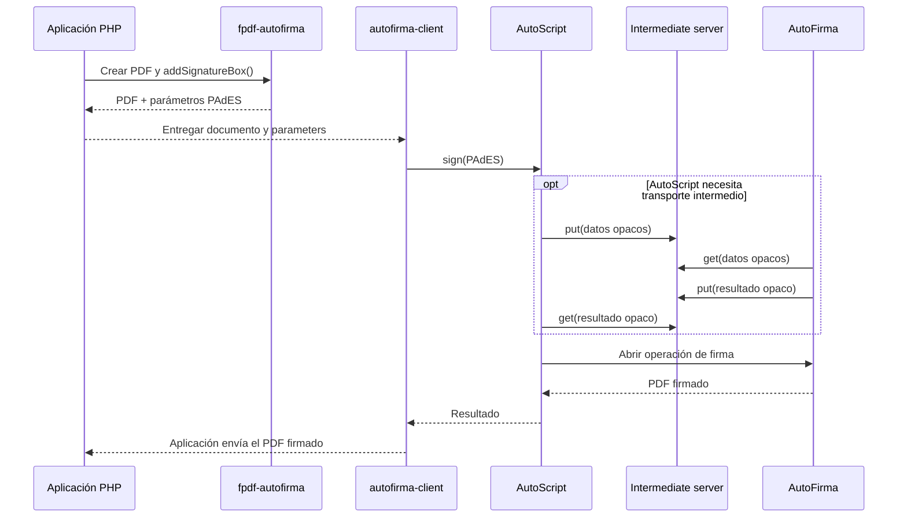

# Arquitectura y coordenadas

## Alcance

El paquete resuelve una frontera concreta: FPDF trabaja con un sistema de coordenadas cómodo para maquetación, mientras que AutoFirma necesita las coordenadas de un rectángulo PDF para colocar una firma PAdES visible.

No se implementa la firma, AutoScript, el transporte intermedio ni la validación criptográfica.

## Componentes internos

### `FpdfAutoFirma`

Fachada pública y extensión de `FPDF`. Asocia cada recuadro a la página activa, valida que quepa en ella y conserva sus parámetros por nombre.

### `SignatureBox`

Value object con la geometría expresada en unidades FPDF y el texto de la firma visible. Rechaza definiciones inválidas antes de convertirlas.

### `CoordinateConverter`

Transforma coordenadas FPDF a coordenadas PDF sin depender de HTTP, WordPress ni AutoFirma. Al ser una clase pura puede probarse de forma determinista.

### `PdfRectangle`

Representa el rectángulo final en puntos PDF y con origen inferior izquierdo.

### `AutoFirmaParameters`

Construye el conjunto mínimo de extra parameters para una firma PAdES visible con texto.

## Conversión

FPDF usa el origen superior izquierdo y una coordenada `y` creciente hacia abajo. PDF usa el origen inferior izquierdo y `y` crece hacia arriba.

Para una página de altura `H`, un recuadro FPDF `(x, y, width, height)` y el factor de conversión de FPDF `k` hacia puntos PDF:

```text
lowerLeftX  = x * k
lowerLeftY  = (H - y - height) * k
upperRightX = (x + width) * k
upperRightY = (H - y) * k
```

El resultado se redondea al punto PDF más cercano. La geometría se valida antes de la conversión para evitar posiciones negativas o fuera de página.

## Arquitectura de integración

`fpdf-autofirma` es únicamente la capa PHP. La operación de firma pertenece al navegador y a AutoFirma.

```mermaid
flowchart LR
    subgraph Backend[Backend PHP]
        APP[Aplicación]
        FPDF[fpdf-autofirma]
        APP --> FPDF
    end

    subgraph Browser[Navegador]
        FRONT[Frontend]
        CLIENT[@erseco/autofirma-client]
        SCRIPT[AutoScript]
        FRONT --> CLIENT --> SCRIPT
    end

    subgraph UserDevice[Equipo de la persona usuaria]
        AF[AutoFirma]
        CERT[Certificado]
        AF --> CERT
    end

    FPDF -->|PDF + parámetros PAdES| FRONT
    SCRIPT --> AF
    AF -->|PDF firmado| SCRIPT
    CLIENT -->|resultado| FRONT
    FRONT -->|guardar / validar| APP

    SCRIPT -. transporte opcional .-> SERVER[autofirma-intermediate-server]
    SERVER -. datos temporales opacos .-> SCRIPT
```

### Responsabilidad de cada proyecto

| Proyecto | Capa | Responsabilidad |
| --- | --- | --- |
| `erseco/fpdf-autofirma` | PHP | Generar el PDF y traducir una caja FPDF a parámetros de firma PAdES visible. |
| [`@erseco/autofirma-client`](https://github.com/erseco/autofirma-client) | Navegador | Envolver AutoScript, normalizar datos/errores e iniciar la operación de firma con AutoFirma. |
| [`erseco/autofirma-intermediate-server`](https://github.com/erseco/autofirma-intermediate-server) | HTTP | Implementar el almacenamiento y recuperación temporal que AutoScript necesita en determinados flujos. |
| `wp-autofirma` | WordPress | Integración concreta que consume las capas anteriores dentro de WordPress. |

## Dependencias obligatorias y condicionales

### `setasign/fpdf`

Es una dependencia Composer directa y obligatoria. `FpdfAutoFirma` extiende `FPDF` y utiliza su tamaño de página y factor de conversión a puntos.

### `@erseco/autofirma-client`

No es una dependencia del paquete PHP porque pertenece al frontend. Es la integración recomendada para enviar el PDF y los parámetros generados por esta librería a AutoScript/AutoFirma.

Técnicamente una aplicación puede invocar directamente el AutoScript oficial, por lo que `@erseco/autofirma-client` no forma parte del grafo de dependencias Composer. Separarlo evita acoplar PHP a una herramienta JavaScript concreta.

### `autofirma-intermediate-server`

Es condicional. Solo debe desplegarse cuando el modo de comunicación de AutoScript utilizado necesite URLs de almacenamiento y recuperación intermedia, como ocurre en determinados escenarios móviles.

No debe configurarse por defecto ni tratarse como un repositorio documental. El contenido intercambiado es temporal y opaco para el servidor intermedio.

## Flujo de datos



El diagrama representa responsabilidades, no obliga a que la aplicación use exactamente esos endpoints o mecanismos para transportar el resultado entre navegador y backend.

## Decisiones de diseño

- Las áreas se registran sobre la página FPDF activa: evita tener que reconstruir tamaños y orientaciones de páginas anteriores.
- Los nombres son únicos para que una aplicación pueda seleccionar inequívocamente qué firma ejecutar.
- La API no expone un método `sign()` porque PHP no ejecuta AutoFirma.
- El núcleo no genera URLs, tokens ni sesiones de servidor intermedio.
- El núcleo no depende de JavaScript ni empaqueta `autoscript.js`.
- El núcleo no afirma que una firma sea válida; esa comprobación requiere validación criptográfica en servidor o un servicio de confianza adecuado.

## Frontera de seguridad

El PDF firmado que vuelve del navegador no debe considerarse válido solo porque AutoFirma haya devuelto datos. Para decisiones jurídicas, de identidad o autorización, la aplicación consumidora debe validar en servidor como mínimo:

- integridad criptográfica del PDF;
- certificado firmante;
- cadena de confianza;
- periodo de validez;
- revocación cuando proceda;
- políticas adicionales exigidas por el caso de uso.
