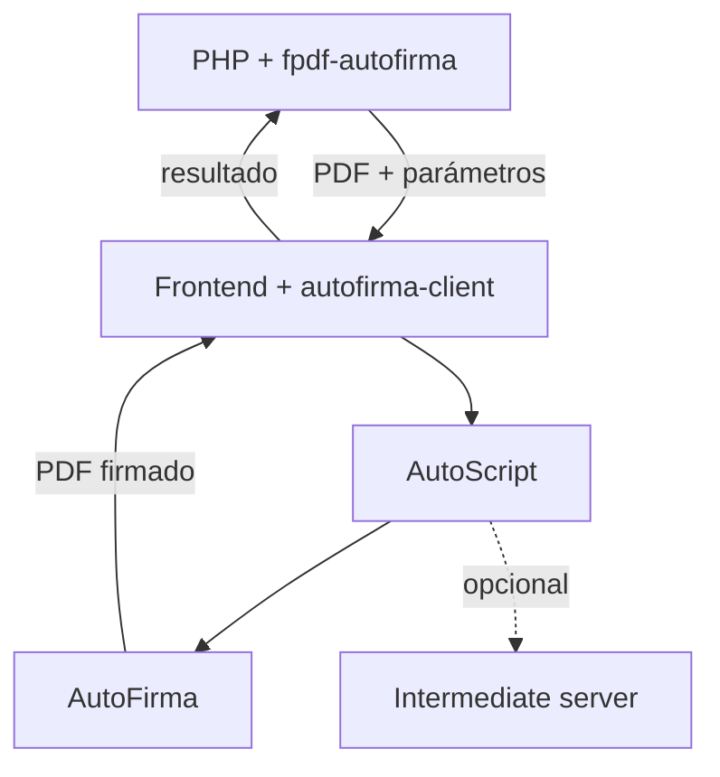

# Uso e integración

## Qué necesita cada parte

`fpdf-autofirma` prepara el documento en PHP, pero **no ejecuta la firma**. Para completar una firma electrónica hay que integrar también una capa de navegador que invoque AutoScript y disponer de AutoFirma en el equipo de la persona usuaria.

El conjunto recomendado es:

1. `erseco/fpdf-autofirma` en PHP para generar el documento y los parámetros PAdES.
2. [`@erseco/autofirma-client`](https://github.com/erseco/autofirma-client) en el frontend para invocar AutoScript/AutoFirma.
3. AutoFirma instalada en el dispositivo que realiza la firma.
4. [`erseco/autofirma-intermediate-server`](https://github.com/erseco/autofirma-intermediate-server) únicamente cuando AutoScript necesite transporte intermedio.

El cliente JavaScript y el servidor intermedio no son dependencias Composer de este paquete.



## Crear un área de firma

`FpdfAutoFirma` extiende la clase `FPDF`, por lo que conserva su API habitual. El recuadro de firma se define después de crear la página en la que debe aparecer:

```php
use Erseco\FpdfAutoFirma\FpdfAutoFirma;

$pdf = new FpdfAutoFirma();
$pdf->AddPage();
$pdf->SetFont('Helvetica', '', 12);
$pdf->Cell(0, 10, 'Documento para firma');

$pdf->addSignatureBox(
    'approval',
    130,
    240,
    60,
    25,
    'Firmado por $$SUBJECTCN$$ el $$SIGNDATE=dd/MM/yyyy$$'
);
```

Los argumentos geométricos usan exactamente la misma unidad configurada al crear FPDF (`mm` por defecto). `x` e `y` indican la esquina superior izquierda del recuadro, igual que el resto de operaciones de posicionamiento de FPDF.

El nombre identifica el recuadro dentro del documento y debe ser único.

## Obtener los parámetros de AutoFirma

```php
$parameters = $pdf->getAutoFirmaParameters('approval');
```

El resultado contiene los parámetros oficiales necesarios para una firma PAdES visible:

```text
signaturePositionOnPageLowerLeftX
signaturePositionOnPageLowerLeftY
signaturePositionOnPageUpperRightX
signaturePositionOnPageUpperRightY
signaturePage
layer2Text
```

Las coordenadas se entregan en puntos PDF y con origen en la esquina inferior izquierda.

## Generar el PDF

FPDF puede devolver el documento como cadena:

```php
$pdfData = $pdf->Output('S');
```

Una aplicación web puede preparar una respuesta para su frontend, por ejemplo:

```php
$payload = [
    'data' => base64_encode($pdfData),
    'parameters' => $parameters,
];
```

Codificar y transportar el documento no forma parte del núcleo de esta librería; el ejemplo solo muestra una forma habitual de enlazar PHP con el navegador.

## Firmar en el navegador

La integración recomendada es [`@erseco/autofirma-client`](https://github.com/erseco/autofirma-client):

```bash
npm install @erseco/autofirma-client
```

Consulta el README de ese proyecto para conocer el estado de sus versiones y la forma recomendada de servir la copia fijada de `autoscript.js`.

Un flujo simplificado puede consumir directamente el Base64 y los parámetros generados en PHP:

```ts
import {
  AutoFirmaClient,
  loadAutoScript,
} from "@erseco/autofirma-client";

const response = await fetch("/document-to-sign");
const payload = await response.json();

const autoScript = await loadAutoScript("/vendor/autoscript.js");
const client = new AutoFirmaClient({ autoScript });

client.initialize();

const result = await client.sign({
  data: payload.data,
  format: "PAdES",
  parameters: {
    mode: "implicit",
    ...payload.parameters,
  },
});

console.log(result.signature);
```

Las cadenas que recibe `@erseco/autofirma-client` se interpretan como Base64, por lo que el ejemplo anterior es compatible con `base64_encode($pdfData)`.

El código de aplicación debe enviar después `result.signature` al backend si necesita almacenar o validar el PDF firmado.

> [!NOTE]
> `@erseco/autofirma-client` es la integración recomendada, pero no es técnicamente imprescindible para esta librería PHP. Una aplicación también puede integrar directamente la API oficial AutoScript y pasarle los mismos parámetros generados por `fpdf-autofirma`.

## Servidor intermedio

El servidor intermedio **no debe desplegarse por defecto**. Solo es necesario cuando AutoScript necesita las URLs de almacenamiento y recuperación que forman parte de su protocolo de transporte, especialmente en determinados escenarios móviles.

Para esos casos puede utilizarse [`erseco/autofirma-intermediate-server`](https://github.com/erseco/autofirma-intermediate-server).

El cliente se configura con las URLs que exponga la aplicación:

```ts
const client = new AutoFirmaClient({
  storageUrl: "https://example.org/autofirma/storage",
  retrieveUrl: "https://example.org/autofirma/retrieve",
});
```

La forma exacta de generar esas URLs, protegerlas y asociarlas a una sesión pertenece a la aplicación consumidora. `fpdf-autofirma` no crea sesiones, tokens ni endpoints HTTP.

El servidor intermedio tampoco firma ni valida documentos. Su responsabilidad es únicamente transportar temporalmente datos opacos entre AutoScript y AutoFirma.

## Varias áreas

Cada área conserva la página activa en el momento de su creación:

```php
$pdf->AddPage();
$pdf->addSignatureBox('first', 20, 240, 70, 25, 'Primera firma: $$SUBJECTCN$$');

$pdf->AddPage();
$pdf->addSignatureBox('second', 120, 240, 70, 25, 'Segunda firma: $$SUBJECTCN$$');

$all = $pdf->getAllAutoFirmaParameters();
```

También están disponibles:

```php
$pdf->hasSignatureBox('first');
$pdf->getSignatureBoxNames();
```

## Errores

La librería rechaza antes de generar parámetros:

- nombres vacíos o duplicados;
- texto visible vacío;
- coordenadas negativas o no finitas;
- ancho o alto iguales o inferiores a cero;
- recuadros que queden fuera de la página;
- consultas a recuadros inexistentes;
- intentos de añadir un recuadro antes de crear una página FPDF.

Estas comprobaciones validan la geometría y la coherencia de los parámetros. No validan certificados ni firmas electrónicas.

## Validación del resultado

Que AutoFirma devuelva un PDF firmado no convierte al navegador en una frontera de confianza. Si la firma tiene consecuencias jurídicas, de identidad o de autorización, el backend debe validar de forma independiente:

- la integridad de la firma;
- el certificado firmante;
- la cadena de confianza;
- las fechas de validez;
- la revocación cuando proceda;
- cualquier política adicional requerida por la aplicación.
